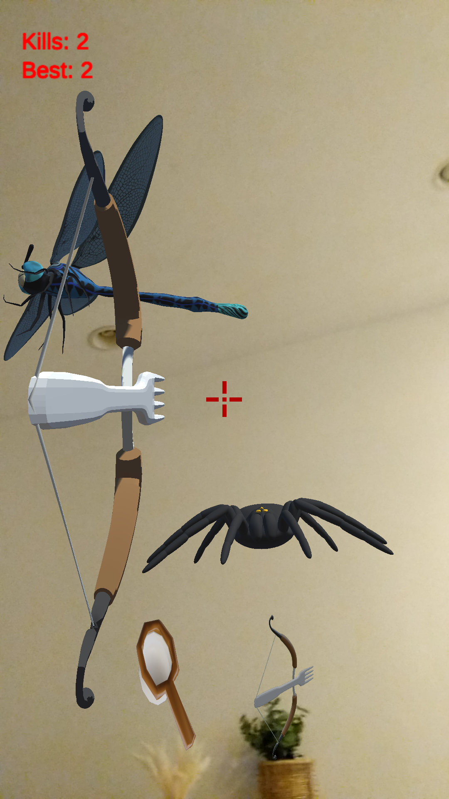
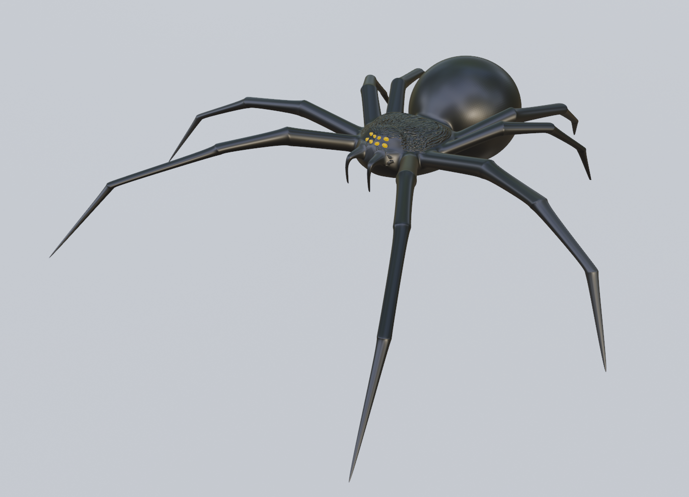
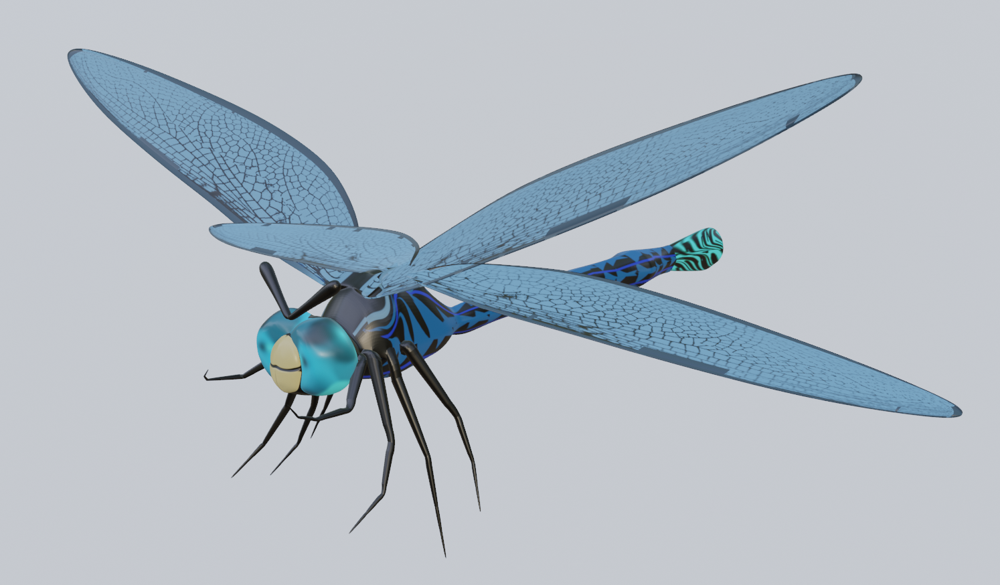
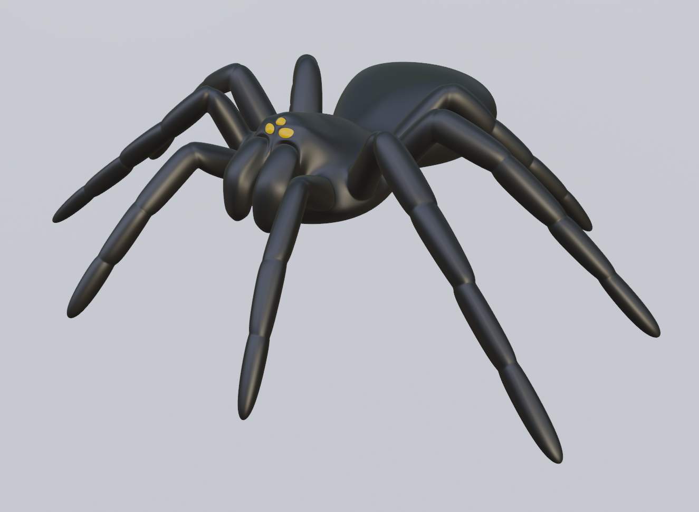

# Monster Hunter
This repo contains the assets for a mobile AR game built with Unity and C#. 
All models and animations in the game built with Blender.

## Objective
Currently the "monsters" that attack you are giant tarantulas which pop up at random 
locations all around you and shoot web bullets which lower your health. You are given a 
bow n arrow (which is actually a giant fork) and have to move your phone around to find 
them and shoot back. Shoot as many as you can before your health reaches 0. Firefly also 
appear at random times and fly around. Catch 10 of them with a net to generate lightning
which kills all currently spawned tarantulas.

## Models and Gameplay

